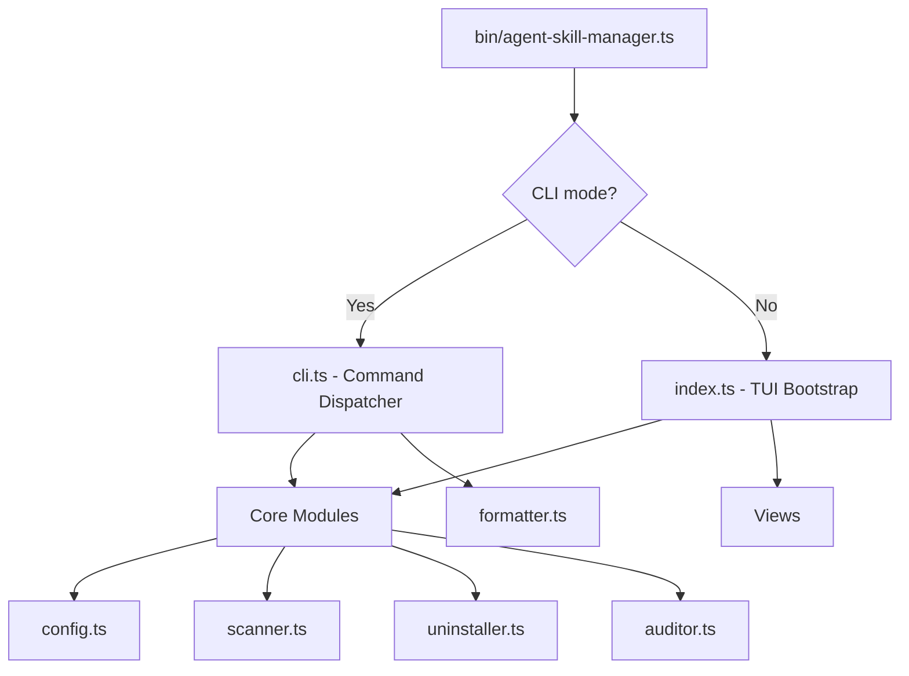
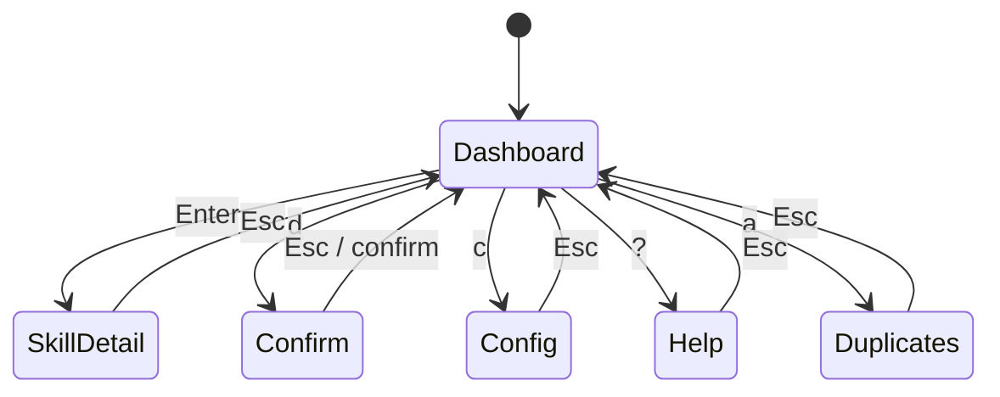
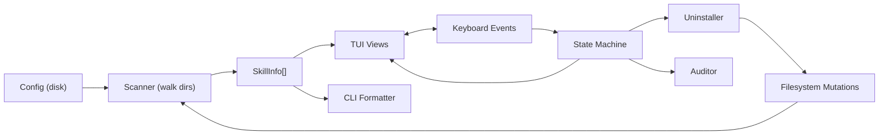

# Architecture

## Overview

agent-skill-manager is a dual-interface application (interactive TUI + non-interactive CLI) that scans, displays, and manages skills installed for various AI coding agents. It follows a layered architecture: CLI entry → mode detection → core modules → output (TUI views or formatted CLI output).

## Entry Point

**`bin/agent-skill-manager.ts`** — Determines the execution mode:

- If CLI arguments are present (commands or flags), delegates to `cli.ts`
- If no arguments, launches the interactive TUI via `index.ts`

## CLI Mode (`src/cli.ts`)

Parses arguments and dispatches to command handlers:

| Command              | Handler          | Description                      |
| -------------------- | ---------------- | -------------------------------- |
| `list`               | `cmdList()`      | Scan and display all skills      |
| `search <query>`     | `cmdSearch()`    | Filter skills by query           |
| `inspect <name>`     | `cmdInspect()`   | Show detailed skill info         |
| `uninstall <name>`   | `cmdUninstall()` | Remove a skill with confirmation |
| `audit [duplicates]` | `cmdAudit()`     | Detect/remove duplicate skills   |
| `config `       | `cmdConfig()`    | Manage configuration             |

Output is routed through `formatter.ts` for consistent table, detail, and JSON formatting.

## TUI Mode (`src/index.tsx`)

Renders the root ink/React component, wires up keyboard handlers (`useInput`), and manages view state transitions.

### View State Machine

### Views (`src/views/`)

Each view is an ink/React component:

| View         | File               | Purpose                                              |
| ------------ | ------------------ | ---------------------------------------------------- |
| Dashboard    | `dashboard.tsx`    | Main layout with scope tabs, search input, stats bar |
| Skill List   | `skill-list.tsx`   | Scrollable, selectable list of discovered skills     |
| Skill Detail | `skill-detail.tsx` | Overlay showing full skill metadata                  |
| Confirm      | `confirm.tsx`      | Uninstall confirmation dialog with removal plan      |
| Duplicates   | `duplicates.tsx`   | Two-phase audit overlay (groups → instance picker)   |
| Config       | `config.tsx`       | Provider toggle UI                                   |
| Help         | `help.tsx`         | Keyboard shortcut overlay                            |

## Core Modules

| Module      | File             | Responsibility                                                       |
| ----------- | ---------------- | -------------------------------------------------------------------- |
| Config      | `config.ts`      | Load/save config from `~/.config/agent-skill-manager/config.json`    |
| Scanner     | `scanner.ts`     | Walk provider directories, parse SKILL.md frontmatter, filter & sort |
| Auditor     | `auditor.ts`     | Detect duplicate skills, rank instances for keeping, format reports  |
| Uninstaller | `uninstaller.ts` | Build removal plans and execute safe deletions                       |
| Formatter   | `formatter.ts`   | ASCII table, detail view, and JSON output formatting                 |
| Eval        | `eval/`          | Pluggable skill evaluation framework (see below)                     |

## Evaluation Framework (`src/eval/`)

`asm eval` evaluates a skill and produces a scored report. Internally it is a **provider framework** — individual evaluators plug into a common `EvalResult` shape through the `EvalProvider` contract, so static linters, runtime LLM-judge tools, and future domain-specific evaluators all flow through the same CLI surface.

| File                         | Responsibility                                                           |
| ---------------------------- | ------------------------------------------------------------------------ |
| `eval/types.ts`              | Contract types: `EvalProvider`, `EvalResult`, `SkillContext`, `EvalOpts` |
| `eval/registry.ts`           | `register()`, `resolve(id, semverRange)`, `list()`; minimal semver impl  |
| `eval/runner.ts`             | Timing, error normalization, timeout enforcement around `provider.run()` |
| `eval/config.ts`             | Reads the `eval` section of `~/.asm/config.yml` with typed defaults      |
| `eval/providers/index.ts`    | Calls `register()` for every built-in provider                           |
| `eval/providers/quality/v1/` | Static SKILL.md linter — adapter over `src/evaluator.ts`                 |

### Provider contract

Every provider implements `EvalProvider` (see `eval/types.ts`):

- `id` + `version` — resolved via `resolve("id", "^1.0.0")` with minimal semver-range support
- `schemaVersion` — integer, bumps only when the `EvalResult` shape changes structurally
- `applicable(ctx, opts)` — cheap feasibility check; returns `{ ok, reason }`
- `run(ctx, opts)` — full evaluation; returns a normalized `EvalResult`

The runner centralizes three cross-cutting concerns so providers stay narrow:

1. **Timing** — stamps `startedAt` (ISO-8601) and `durationMs` on every result
2. **Error normalization** — provider throws become error-shaped results with a single `severity: "error"` finding; callers never need try/catch
3. **Timeout enforcement** — races the provider against `opts.timeoutMs` / `opts.signal`

See [`docs/eval-providers.md`](./eval-providers.md) for the user-facing workflow and the checklist for adding a new provider.

## Utilities (`src/utils/`)

| File             | Purpose                                                                |
| ---------------- | ---------------------------------------------------------------------- |
| `types.ts`       | Shared TypeScript interfaces (`SkillInfo`, `AppConfig`, `Scope`, etc.) |
| `colors.ts`      | Neon green color palette for the TUI                                   |
| `version.ts`     | Version constant used across CLI and TUI                               |
| `frontmatter.ts` | YAML-like frontmatter parser for SKILL.md files                        |

## Data Flow

## State Management

Application state is held in module-level variables in `src/index.ts`:

- `allSkills` / `filteredSkills` — current skill data
- `currentScope` / `currentSort` / `searchQuery` — filter state
- `viewState` — which overlay is active (`dashboard`, `detail`, `confirm`, `config`, `help`, `duplicates`)

State transitions are driven by keyboard events and propagated to views via update functions.

## Duplicate Detection (`src/auditor.ts`)

Two independent rules identify duplicates:

1. **Same directory name** across different locations (e.g., `my-skill` in both `~/.claude/skills` and `~/.codex/skills`)
2. **Same frontmatter name** but different directory names (e.g., two skills both named "Code Review" in frontmatter)

When removing duplicates, instances are ranked deterministically:

1. Global scope preferred over project scope
2. Then by provider label alphabetically
3. Then by path alphabetically

## Uninstall Process (`src/uninstaller.ts`)

The uninstaller builds a removal plan that covers:

1. **Skill directory** — the skill folder itself (handles symlinks)
2. **Rule files** — tool-specific rule files (project scope only):
   - `.cursor/rules/{skillName}.mdc`
   - `.windsurf/rules/{skillName}.md`
   - `.github/instructions/{skillName}.instructions.md`
3. **AGENTS.md blocks** — removes block markers from AGENTS.md files, supporting multiple legacy formats
